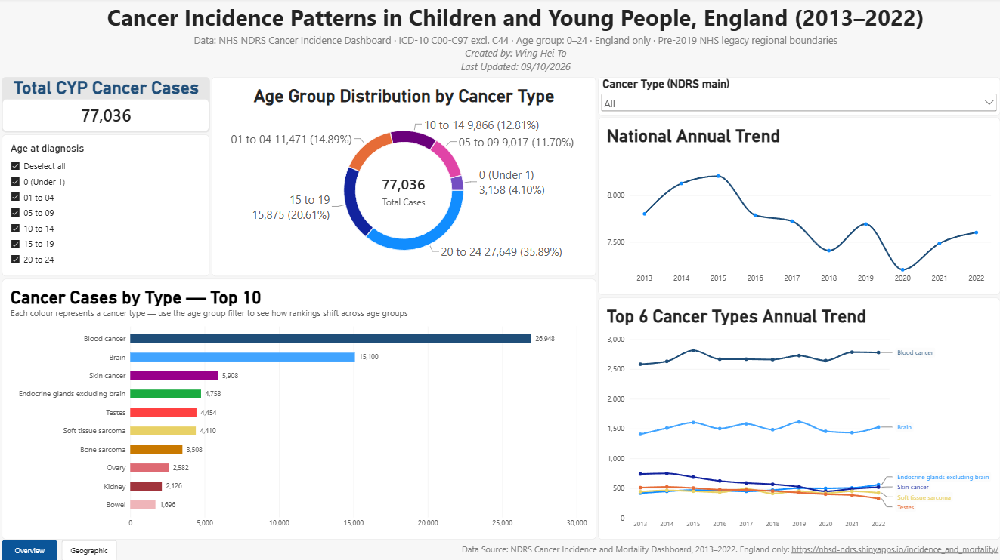
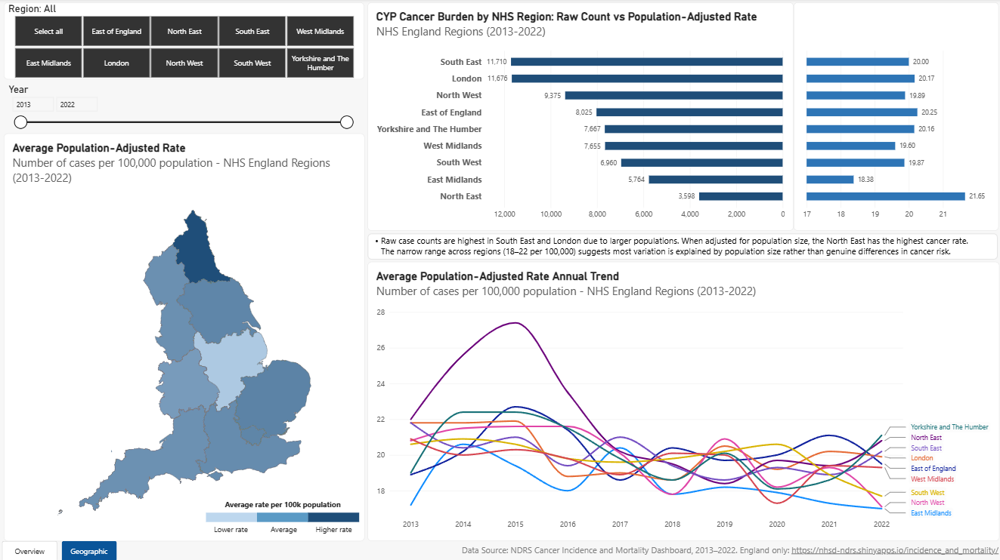
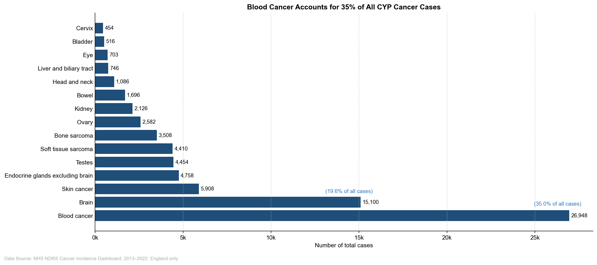
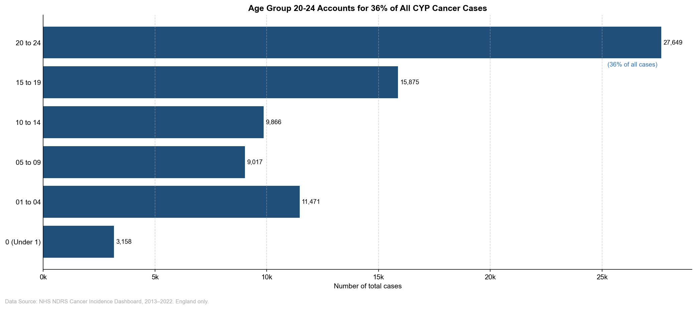
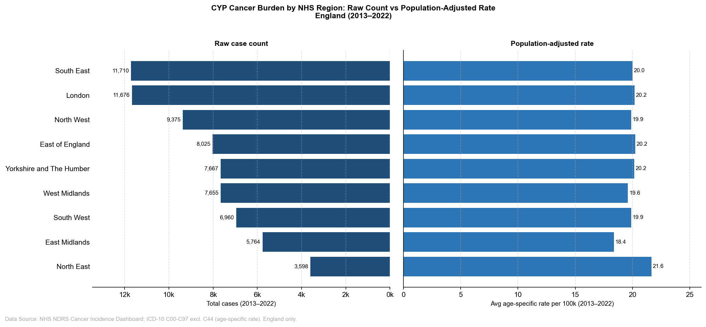

# From childhood to Young Adulthood: Understanding Cancer Incidence Patterns in England

## Project Overview

This project analyses cancer incidence patterns among children and young people aged 0-24 in England.

The analysis focuses on:

1. Age profiles and cancer type composition
2. Geographic variation across NHS England regions
3. Changes in incidence patterns between 2013 and 2022

## Project Structure
    cyp-cancer-incidence-england/
    ├── 0_data/                 # Data folder
        ├── 0_raw/
        ├── 1_validated/
        ├── 2_sqlite/
        └── 3_powerbi/

    ├── 1_notebooks/            # Jupyter notebooks for data cleaning, validation and analysis

    ├── 2_sql/                  # SQL queries for structured data analysis

    ├── 3_output/               # Images, dashboard and insight summary (insight summary in progress)
        ├── 1_dashboard/
        ├── 2_report/
        └── 3_images/

    ├── requirements.txt        # Python dependencies

    └── README.md

## Data Sources

- **National dataset: NDRS Cancer Incidence and Mortality Dashboard**
    - England-level data where each row represents a unique aggregated observation defined by year, gender, age group at diagnosis (Under 1, 1-4, 5-9, 10-14, 15-19, 20-24), and NDRS cancer classification. Coverage: 2013-2022

- **Regional dataset: NDRS Cancer Incidence and Mortality Dashboard**
    - NHS England region-level data where each row represents a unique aggregated observation defined by year, gender, NHS region, and NDRS cancer classification. Age group aggregated to 0-24. Coverage: 2013-2022

- **ICD10 Regional dataset: NDRS Cancer Incidence and Mortality Dashboard**
    - Supplementary dataset, NHS England region-level data where each row represents a unique age-specific rate observation defined by year and NHS region. Uses ICD-10 cancer classification (C00-C97 excl. C44). Age group aggregated to 0-24. Used for population-adjusted regional comparison only. Coverage: 2013-2022

- **Geographic levels consideration for regional analysis:**
    - Regional data uses pre-2019 NHS England legacy boundaries (**9** regions), retained across the full analysis period for consistency.
    - Regional analysis uses NHS England Region level, which provides sufficient case volumes for meaningful comparison of cancer incidence patterns across the 0-24 age group. Finer geographic levels (e.g. ICB, UTLA, LAUA) were considered but rejected due to small number suppression risk for rare cancer types in the CYP age group.

**Note:**
- The national and regional datasets use NDRS Cancer Group classification, which is aligned with the International Classification of Childhood Cancer Third Edition (ICCC-3) and is the standard grouping used for paediatric and young adult cancer analysis in England. The supplementary ICD-10 regional dataset uses ICD-10 site-based classification (C00-C97 excl. C44). Direct comparison across datasets or with external publications using different classification systems should be made with caution. 
- Data is England-specific and excludes Scotland, Wales, and Northern Ireland.
- NHS cancer registration data is published in aggregated form - no individual patient records are used or accessible in this analysis.
- Incidence rates and confidence intervals are suppressed (represented as [u]) where the underlying count is fewer than 3, in line with NHS Digital disclosure control policy. Counts themselves are published for all records.
- Rate-based analysis is restricted to records with published numerical estimates. Suppressed rates are not interpreted as zero and are excluded from rate calculations.
- Due to high rate suppression in the NDRS national and regional datasets (driven by small case counts for rare cancer types in the CYP age group), count-based analysis is used throughout Sections 1 and 3. The supplementary ICD-10 regional dataset — where all 90 region-year records have published rates — is introduced as a workaround for population-adjusted regional comparison in Section 2.

## Data Validation Findings

Full validation documented in `1_notebooks/01_data_validation.ipynb`.

### National Dataset (15,480 records after filtering to CYP 0–24 age group)

- **Complete core fields:** All analytical dimensions (year, gender, age group, 
  cancer classification) are fully populated with no standard missing values.
- **Grain validated:** Each row uniquely identified by year, gender, age group, 
  NDRS main, and NDRS detailed. No duplicate rows.
- **Classification change (2018):** The NDRS detailed field shows a structural 
  change from 2018 onwards — 'Cardia and oesophagogastric junction' was split 
  into 'Cardia' and 'Oesophagogastric junction'. The NDRS main classification 
  remains consistent across the full period. This is documented and accounted 
  for in trend analysis at the detailed cancer type level.
- **Suppressed values:** Incidence rates and confidence intervals are suppressed 
  ([u]) for 11,869 of 15,480 records, primarily in younger age groups and rarer 
  cancer types where counts fall below 3. Counts are available for all records. 
  Suppressed values are not interpreted as zeros.
- **Numeric conversion:** Rate and confidence interval columns converted to 
  numeric with suppressed values ([u]) coerced to NaN. Validated that all NaN 
  values correspond exactly to [u] in the original columns.

### Regional Dataset (18,090 records, age group aggregated to 0–24)

- **Complete core fields:** All analytical dimensions fully populated with no standard missing values.
- **Grain validated:** Each row uniquely identified by year, gender, geography, NDRS main, and NDRS detailed. No duplicate rows.
- **Geographic coverage:** Nine pre-2019 NHS England legacy regions confirmed present across all years: East Midlands, East of England, London, North East, North West, South East, South West, West Midlands, Yorkshire and The Humber.
- **Classification change (2018):** The same NDRS detailed structural change identified in the national dataset is present in the regional dataset.
- **Reduced cancer group coverage:** The regional dataset contains 31 NDRS main and 110 NDRS detailed categories, compared to 32 and 133 in the national dataset. The reduced coverage reflects NDRS disclosure control — cancer types with consistently small counts at regional level are excluded from publication.
- **Classification difference (bladder and renal pelvis):** Four NDRS detailed categories present in the regional dataset use behaviour-based groupings (malignant or in situ / uncertain or unknown) rather than the stage-specific subcategories used in the national dataset. Case counts for these categoriesare negligible in the 0–24 age group (median: 0, max: 7). As both datasets are analysed separately, this does not affect the analysis.
- **Suppressed values:** 13,292 of 18,090 records have suppressed rates and confidence intervals, concentrated in rarer cancer types at regional level.

### ICD-10 Regional Rates Dataset (90 records)

- **Complete and unsuppressed:** All 90 records (9 regions × 10 years) have published age-specific rates with no suppression. This dataset was selected specifically because aggregating all malignant cancers (C00-C97 excl. C44) produces case volumes above the suppression threshold for every region-year combination.
- **Geographic coverage:** Same nine pre-2019 NHS England legacy regions as the regional dataset. A trailing space in the Geography name column was identified and corrected on load.
- **Rate range:** Age-specific rates range from 17.0 to 27.4 per 100,000 population aged 0–24 across all region-year combinations, consistent with published NHS England figures for CYP cancer incidence.
- **Single cancer classification:** Uses ICD-10 C00-C97 excl. C44 (all malignant cancers excluding non-melanoma skin cancer). Not directly comparable with NDRS Cancer Group findings — used for population-adjusted regional comparison only.

## Tools and Technologies

| Tool | Purpose |
|---|---|
| **Python 3.10** | Data validation, cleaning, analysis, and visualisation |
| **pandas** | Data manipulation and aggregation |
| **matplotlib / seaborn** | Chart production (10 analytical charts) |
| **Jupyter Notebook** | Interactive analysis environment |
| **SQLite / DB Browser for SQLite** | SQL-based analysis (10 queries) |
| **Power BI Desktop** | Interactive dashboard |
| **Git / GitHub** | Version control and project hosting |

Full Python dependencies listed in `requirements.txt`.

## Project Status

### Notebook 01 - Data Validation & Quality Assessment: Completed
- Structural validation, schema checks, expected value validation, coverage analysis, grain validation, suppression mapping, classification consistency review, numeric conversion, and parquet output completed for both national, regional and icd-10 dataset.

### Notebook 02 - Analysis: Completed
- Exploratory analysis notebook, including analysis on age profiles and cancer type composition, geographic variation, national and regional trend completed. 10 Analytical charts generated for each of the three business questions.

### SQL queries: Completed
- Documentation of all 10 SQL queries completed, with separate screenshots of all query results.

### Interactive Power BI dashboard: Completed. Publishing in progress.

- In the meantime, the dashboard file (.pbix) can be downloaded and opened in Power BI Desktop (free):

- Download [CYP_Cancer_Dashboard.pbix](3_output/1_dashboard/CYP_Cancer_Dashboard.pbix)

- ONS Official 2016 England regions geojson file is required for the custom map in the dashboard. Download [ons_regions_2016.geojson](0_data/3_powerbi/ons_regions_2016.geojson) and load the geojson file in the dashboard.

- Power BI Desktop download: https://powerbi.microsoft.com/desktop

### In progress:
- one-page insight summary

## Dashboard Preview

### Page 1 — Cancer Type & Age Analysis

### Page 2 — Geographic Analysis

## Analysis Charts

### Age Profiles and Cancer Type Composition

*Blood cancer accounts for 35% of all CYP cancer cases in England (2013–2022)*

*The 20–24 age group accounts for 36% of all cases*

### Geographic Variation

*The North East ranks last by raw case count but first by population-adjusted rate*